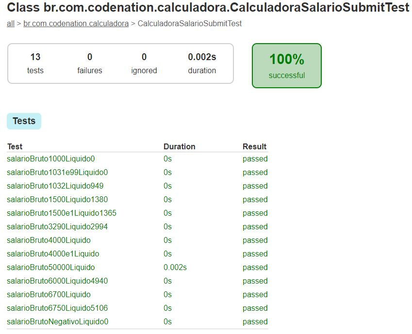

# Calculadora de Salário Líquido

No Brasil, as pessoas que trabalham “com carteira assinada” (CLT) têm uma parte do seu salário bruto (isto é, o salário integral, sem descontos) retida pela empresa empregadora para o pagamento de alguns tributos, como, por exemplo, a Previdência Social (INSS) e o Imposto de Renda Retido na Fonte (IRRF). Após esse desconto, o valor que a pessoa contratada recebe é denominado salário líquido.

Neste desafio, vamos implementar um algoritmo que será responsável por receber como parâmetro o salário bruto e retornar o salário líquido, já com todos os descontos de INSS e IRRF. Esse algoritmo deve ser implementado na classe CalculadoraSalario no método calcularSalarioLiquido, esse método deve receber um valor do tipo double e retornar um valor do tipo int (Utilize o método Math.round() para arredondar o resultado final).

Lembre-se que é uma boa prática deixar cada método com apenas 1 responsabilidade, então fique à vontade para criar métodos privados na classe para melhorar a legibilidade de seu algoritmo.

Observações: Para simplificar o desafio, serão utilizados valores fictícios e não os valores oficiais das tabelas de alíquotas da Previdência Social e Receita Federal.

Fórmula do cálculo
Primeiro passo
Primeiro deve ser calculado o valor do desconto do INSS, o mesmo deve ser calculado conforme a tabela abaixo:

Faixa salarial	Percentual de desconto
Até R$ 1.500,00	8%
De R$ 1.500,01 até R$ 4.000,00	9%
Acima de R$ 4.000,00	11%
Exemplo: - Para um salário bruto de R$1.000,00 ou R$1.500,00, deverá ser aplicado o desconto de 8% resultando em valores líquidos de R$920,00 ou R$1.380,00, respectivamente. - Para um salário bruto de R$1.500,01 ou R$10.000,00, deverá ser aplicado o desconto de 9% e 11% respectivamente, resultando em valores líquidos de R$1.365,00 ou R$ 8.900,00, respectivamente.

Segundo passo
Após obter o valor do salário bruto - INSS, utilizaremos esse valor como referência para realizar o cálculo do IRRF e realizar o desconto correto. Esse valor de referência (salário bruto - INSS) deverá ter um percentual descontado de acordo com a tabela abaixo:

Faixa salarial	Percentual de desconto
Até R$ 3.000,00	ISENTO
De R$ 3.000,01 até R$ 6.000,00	7.5%
Acima de R$ 6.000,00	15%
Exemplo

Após descontar o INSS, obtivemos o valor de R$1.320,00, como esse valor é até R$ 3.000,00, não haverá desconto do IRRF, totalizando um salário líquido final de R$ 1.320,00.
Após descontar o INSS, obtivemos o valor de R$8.900,00, como esse valor é maior que R$3.000,00, haverá o desconto de 15% desse valor, totalizando um salário líquido final de R$7.565,00.
Observações - Caso o valor do salário base recebido seja abaixo do salário mínimo (R$ 1.039,00), o algoritmo deve retornar 0.0.

# Resultado submetido

